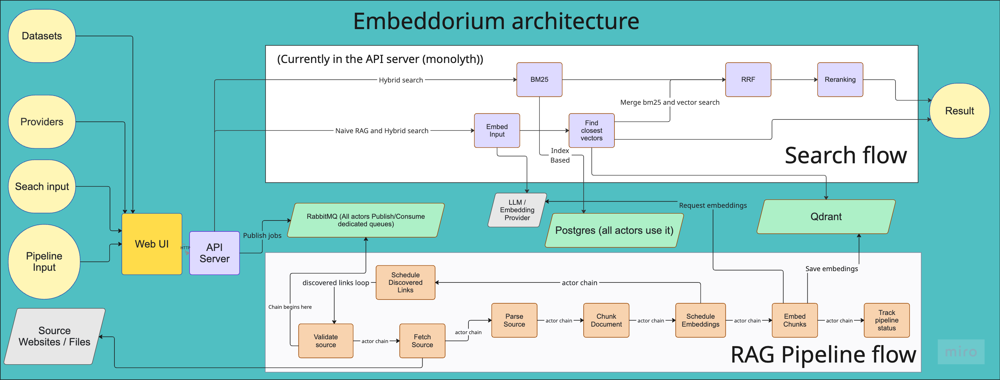

<div align="center">


# Embeddorium

**A local-first RAG pipeline workbench.** Build, inspect, and compare retrieval
pipelines — see exactly what happened during ingest, parsing, chunking,
embedding, storage, and querying instead of treating RAG as a black box.


</div>

---

## Why

Most RAG demos are a single script and a black box. When retrieval is bad, you
can't tell whether the culprit was the fetch, the parse, the chunker, or the
embedding model. Embeddorium runs the full **ingest → parse → chunk → embed →
store → query** loop as a set of small, independent workers on your own machine,
and every stage leaves a durable, inspectable trace — so you can swap models,
tweak chunking, and watch exactly what each stage produced without shipping your
data anywhere.

## Stage

WIP!
It's working but there are a lot of space for improvement.
Some of features not added yet. Short TODO:

# TODO

0. Improve autogenerated (90%) documentation
1. finish up hybrid search (rrf + reranking)
2. visualization of vectors
3. file search should not contain xml restriction
4. actors smarter configuration
5. plugins for all actors
6. actor based search ? Or dedicated server for search at least?
7. Local launch with no docker
8. MCP server
9. Some styles for UI
10. scaling,

## What you can do with it

- Build a local vector knowledge base from **crawled web pages** or **local XML
  files**.
- Compare **chunking** (size / overlap) and **embedding** configurations across
  runs — each run is snapshotted and reproducible.
- Inspect the pipeline end to end: raw fetched bytes, parsed text, chunks,
  metadata, per-URL logs, and the resulting **Qdrant collection**.
- Use a **`mock` provider** for instant end-to-end demos, or **Ollama** for real
  local embeddings.
- **Search** a completed run's collection from the UI or the API — queries are
  embedded with the same model the run used ([docs/search.md](docs/search.md)).
- Add custom **chunking strategies** as auto-discovered plugins — no core code to
  touch ([docs/plugins.md](docs/plugins.md)).
- Test **embedding similarity** between texts in the browser with the embeddings
  tester.

## Who this is for

- Engineers building RAG systems who want a real pipeline, not a notebook.
- Anyone **debugging retrieval quality** and needing to see which stage went
  wrong.
- People working with **private or local datasets** that can't leave the machine.
- Developers **comparing chunking and embedding strategies** side by side.
- People learning **production-style ingestion architecture** (workers, a
  transactional outbox, idempotent retries).

## What it is not

Embeddorium is not a hosted SaaS, and not a polished chatbot product. It is a
**local workbench** for experimenting with and inspecting RAG ingestion and
retrieval pipelines. It runs entirely on your machine via Docker Compose.

## Quick start

The default path uses the **`mock` embedding provider**, so you get a completed
run in seconds without any model. You'll need **Docker** (Compose v2) and
**Git**. For a step-by-step version with expected output, see
[docs/quickstart.md](docs/quickstart.md) and the
[first mock run tutorial](docs/tutorials/first_mock_run.md).

```sh
# 1. Clone
git clone https://github.com/PerminovEugene/web-knoweladge-indexer.git embeddorium && cd embeddorium

# 2. Create the env file (Compose reads it for Postgres/RabbitMQ credentials).
#    Defaults work out of the box.
cp .env.example .env

# 3. Bring up the whole stack. Migrations run automatically via the `migrate`
#    service before any worker starts — no manual migration step.
docker compose up -d --build
```

That starts Postgres, Qdrant, RabbitMQ, every pipeline worker, the API, and the
UI. Then, in the UI (http://localhost:5173):

1. **Providers** → create a provider of type **Mock** (model type `embedding`).
2. **Datasets** → create a dataset. The quickest is a **Web** dataset with a
   single URL and depth `0`.
3. **Pipeline runs** → start a run with that dataset + the mock provider.

**Success condition:** the run reaches **`completed`** in the Pipeline runs page,
and a matching collection appears in the Qdrant dashboard
(http://localhost:6333/dashboard).

Local endpoints:

- UI — http://localhost:5173
- API + interactive docs — http://localhost:8000/docs
- Qdrant dashboard — http://localhost:6333/dashboard
- RabbitMQ management — http://localhost:15672

Stuck? See [docs/troubleshooting.md](docs/troubleshooting.md).

## Use real local embeddings with Ollama (optional)

The mock provider produces random vectors — good for verifying the flow, not
retrieval quality. For real embeddings, point a provider at a local
[Ollama](https://ollama.com) server. Full guide:
[docs/tutorials/ollama_embeddings.md](docs/tutorials/ollama_embeddings.md).

```sh
# On the host running Ollama:
ollama pull qwen3-embedding
```

Then create an **Ollama** provider in the UI (model `qwen3-embedding`, the port
Ollama listens on) and select it for a run.

> **Docker networking:** the embed worker runs in a container, so `localhost`
> won't reach Ollama on your host. Use `host.docker.internal` (Docker Desktop) or
> the Docker bridge IP on Linux. Details in
> [docs/embeddings.md](docs/embeddings.md).

## Architecture



Full walk-through — both chains, the outbox, the status machine, and where data
lives — in [docs/architecture.md](docs/architecture.md).

## Project layout

```
backend/
  shared/        # config, models, parsers, clients, storage (SQLAlchemy + Qdrant)
  actors/        # one directory per pipeline stage
  plugins/       # auto-discovered plugins (chunkers/ today — see docs/plugins.md)
  outbox/        # outbox → RabbitMQ dispatcher
  server/        # FastAPI API + embeddings tester backend
  mcp/           # FastMCP server exposing knowledge-base tools
  agent/         # optional LangGraph chat agent
  tests/         # pytest suite
ui/              # React + Vite front end
infra/           # broker / db / vector config
docs/            # architecture, configuration, usage, tutorials
docker-compose.yml
```

## Documentation

| Guide                                      | Contents                                                              |
| ------------------------------------------ | --------------------------------------------------------------------- |
| [Quick start](docs/quickstart.md)          | Detailed first run, service URLs, reset, common failures              |
| [Usage](docs/usage.md)                     | Starting runs, local XML sources, the agent, the embeddings tester    |
| [Search](docs/search.md)                   | Querying a run's collection from the UI and the API                   |
| [Architecture](docs/architecture.md)       | Pipeline stages, outbox, status machine, storage model                |
| [Configuration](docs/configuration.md)     | Every environment variable, for host and Docker                       |
| [Embeddings](docs/embeddings.md)           | The `mock` / `ollama` / `huggingface` providers and Ollama networking |
| [Concurrency](docs/concurrency.md)         | Per-stage threads/processes, fan-out, embedding load                  |
| [Plugins](docs/plugins.md)                 | Writing your own chunker plugin, auto-discovery, the built-ins        |
| [Development](docs/development.md)         | Setup, tests, linting, migrations, resetting local state              |
| [Troubleshooting](docs/troubleshooting.md) | Startup failures, ports, stuck runs, reading logs                     |
| [Roadmap](docs/roadmap.md)                 | What's shipped, what's next (hybrid search, reranking, evaluation)    |

**Tutorials:**
[First mock run](docs/tutorials/first_mock_run.md) ·
[Ollama embeddings](docs/tutorials/ollama_embeddings.md) ·
[Local XML import](docs/tutorials/local_xml_import.md) ·
[Web crawl](docs/tutorials/web_crawl.md)

## Contributing

Issues and pull requests are welcome. Before opening a PR, run the tests and
Ruff:

```sh
.venv/bin/python -m pytest backend/tests -q
ruff check . && ruff format --check .
```

## License

Licensed under the Apache License 2.0 — see [LICENSE.md](LICENSE.md).
