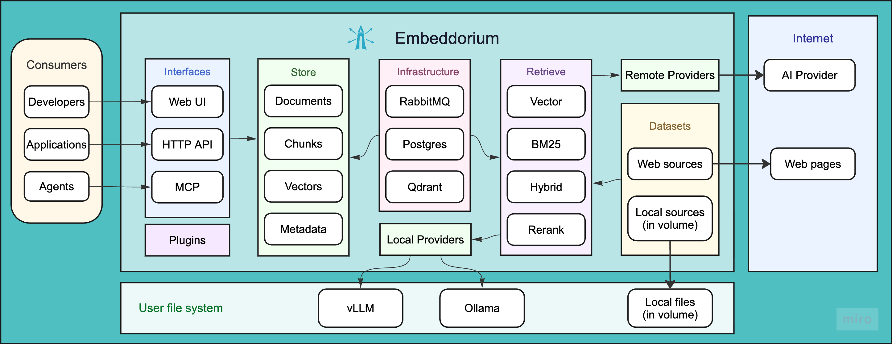

<div align="center">


# Embeddorium

Embeddorium is a local-first platform for turning your data into searchable RAG infrastructure.

<p>
  
  
  
  
  
</p>

</div>

* **Declarative:** Define how your data should be ingested, processed, indexed, and searched. Embeddorium executes the pipeline, preserves every intermediate artifact, and makes each processing step available for inspection. Explicit configurations make retrieval workflows easier to reproduce, understand, compare, and debug.

* **Configuration-First:** Datasets, providers, ingestion pipelines, chunking strategies, embedding models, search methods, fusion, and reranking are all configured independently. Run the same data through different configurations without rewriting application code or rebuilding the entire retrieval stack.

* **Plugin-Based:** Extend Embeddorium with custom parsers, filters, chunkers, embedding providers, rerankers, and other pipeline components. When a data format, model provider, or processing strategy is not supported, add a plugin, refresh the UI, and use it as part of the same pipeline. Spend less time on integration boilerplate and more time improving retrieval.

* **Learn Once, RAG Anything:** Turn websites, local files, and structured documents into searchable datasets for applications and AI agents. Use the built-in UI to configure pipelines and inspect retrieval behavior, then expose indexed knowledge through the HTTP API and MCP server.

## High-level component overview



## Quick start

1. Install Docker Compose v2.

2. Prepare the environment:

```sh
cp .env.docker .env
```

3. Start the containers:

```sh
docker compose up -d
```

4. Open the UI at `http://localhost:5173/`.


## Documentation

Browse the full documentation in [docs/index.md](docs/index.md).

## License

Apache License 2.0. See [LICENSE.md](LICENSE.md).
