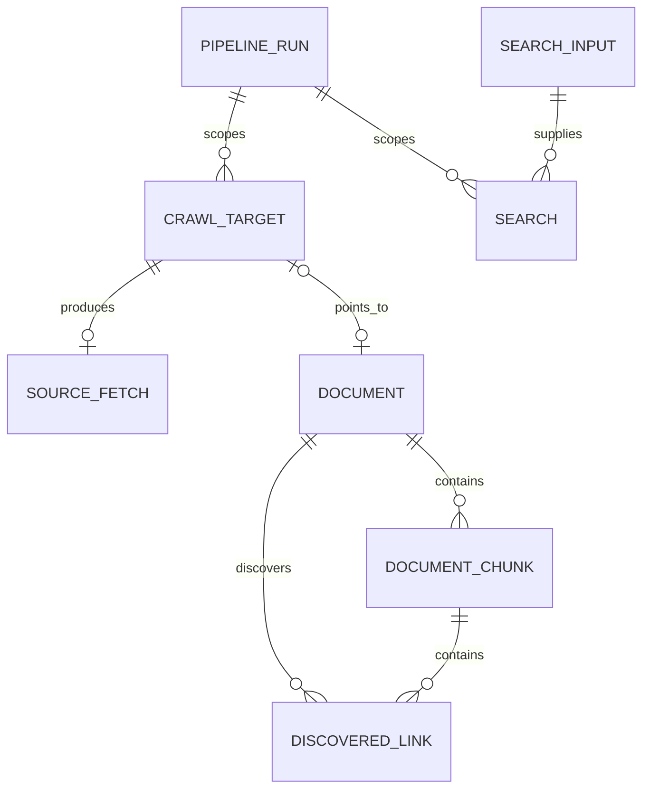

# Domain model

Datasets and providers are intentionally absent from the relationship diagram:
pipeline runs store JSON snapshots rather than foreign keys to those mutable
configuration records.

## Main aggregates

**Configuration.** `datasets` and `providers` are CRUD-managed records. A
`pipeline_run` combines a dataset snapshot, actor configuration, embedding
provider snapshot, lifecycle timestamps, and embedding-batch counters.

**Ingestion.** A `crawl_target` represents one URL/file within one run and owns
the stage status. Its one `source_fetch` records fetch provenance. Parsing
produces a `document`; chunking produces ordered `document_chunks` and
`discovered_links`.

**Retrieval.** `search_inputs` stores query text. `searches` links that input to
a pipeline run and stores strategy configuration and the ordered result list as
JSON.

**Delivery.** `outbox_events` stores a destination queue, actor, JSON payload,
unique deduplication key, publish status, attempt count, and timestamps.

See [Persistence](persistence.md) for the physical stores and delete behavior.
