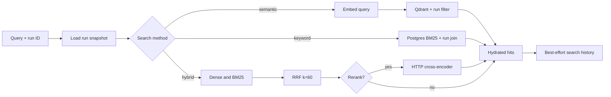

# Retrieval flow

The search API orchestrates retrieval synchronously for each query in the
request.

## Run scoping

Dense points carry `pipeline_run_id`; Qdrant filters on it. BM25 joins
`document_chunks` to `crawl_targets` and filters `crawl_targets.pipeline_id`.
Both paths hydrate chunk text and document source URLs from PostgreSQL.

## Result shape

All methods normalize hits to the same keys: source/query identity, score,
chunk ID, document ID, chunk index/text, dataset name, source URL, and custom
metadata.

## Failure behavior

Missing/invalid run IDs, methods, Top K values, or reranker configuration are
HTTP errors. Embedding, Qdrant, and BM25 runtime failures propagate from the
request. Reranker runtime failures alone degrade to the original hybrid result
order. Search-history persistence failures are logged and swallowed.
