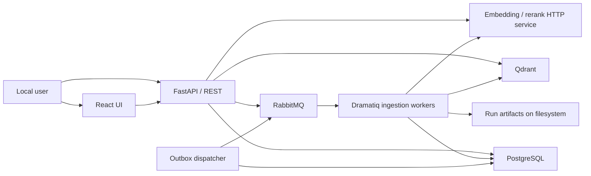

# System context

## Boundaries

**Trusted local boundary.** The UI, API, Postgres, RabbitMQ management UI, and
Qdrant ports are published to the host. Embeddorium adds no user authentication
or authorization.

**Source boundary.** Web workers make outbound HTTP(S) requests. Local-file
workers read the `sources/` bind mount. Web fetches have a 10 MiB response limit
and support only configured text/XML MIME types.

**Model boundary.** Ollama, OpenAI-compatible embedding APIs, and compatible
rerank services are external HTTP processes. Provider config determines the
endpoint and credentials. Only the mock embedder runs inside Embeddorium.

**Storage boundary.** The Compose stack owns three named volumes for Postgres,
Qdrant, and RabbitMQ. Run artifacts use a bind mount so they are visible on the
host.

The incomplete MCP server and agent are not part of the supported runtime
context; see [Limitations](../product/limitations.md).
